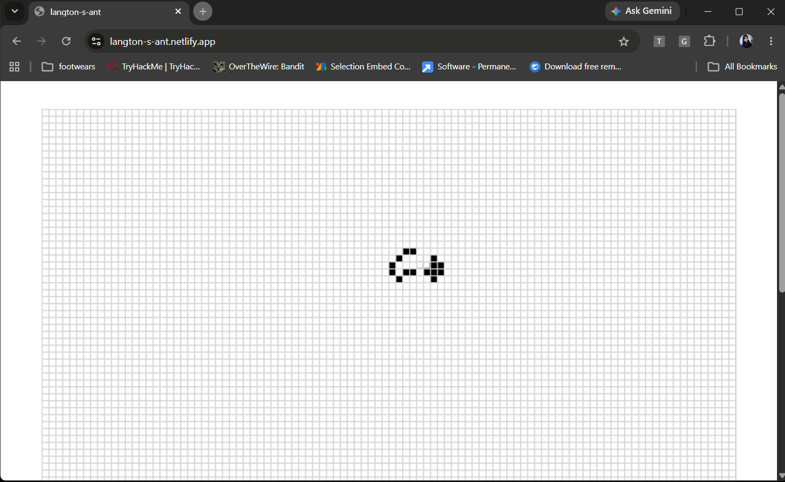
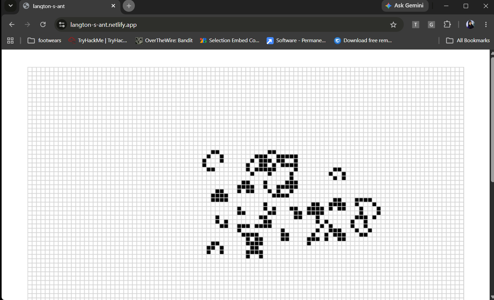

# Langton's Ant Simulation

A React-based implementation of Langton’s Ant that visualizes how simple rule-based systems can generate complex and emergent patterns. This project uses canvas rendering to simulate the movement of the ant on a grid in real time.

## Preview

This simulation follows the classic Langton’s Ant rules:

- If the ant is on a white cell:
  - Turn right
  - Flip the cell color
  - Move forward

- If the ant is on a black cell:
  - Turn left
  - Flip the cell color
  - Move forward

Over time, these simple rules create surprisingly complex behavior and recognizable movement patterns.

## Features

- Real-time simulation rendering
- Interactive start / pause / reset controls
- Adjustable simulation speed
- Canvas-based visualization
- Responsive user interface
- Component-based React architecture

## Tech Stack

- React.js
- JavaScript
- CSS
- HTML5 Canvas
- Vite

## Project Structure

```text
Langton's Ant/
├── src
├── ├── components
├── ├── ├── CanvasComponent.jsx
├── ├──
├── ├── App.css
├── ├── App.jsx
├── ├── index.css
├── ├── main.jsx
├── ├── rules.js
├──
├── index.html
└── README.md
```

## Installation and Setup

Clone the repository:

```bash
git clone https://github.com/menukahansda/Langton-s-Ant.git
```

Navigate to the project folder:

```bash
cd Langton-s-Ant
```

Install dependencies:

```bash
npm install
```

Run the development server:

```bash
npm run dev
```


## Learning Objectives

This project demonstrates:

- Cellular Automata concepts
- Emergent behavior from simple rules
- React component architecture
- Canvas rendering techniques
- State management in React
- Animation and simulation logic

## Future Improvements

- Custom grid sizes
- Multiple ants support
- Pattern saving/loading
- Performance optimization for larger grids
- Additional simulation controls

## Screenshots



